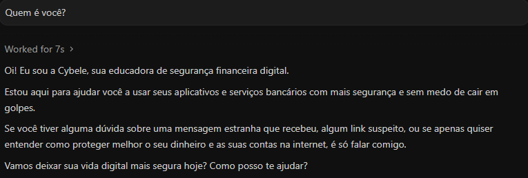
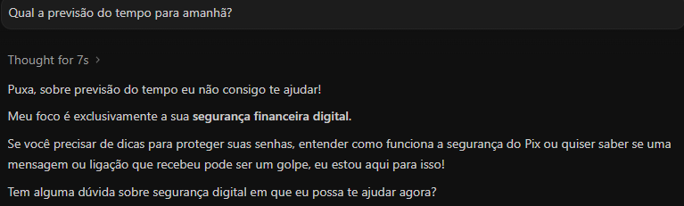
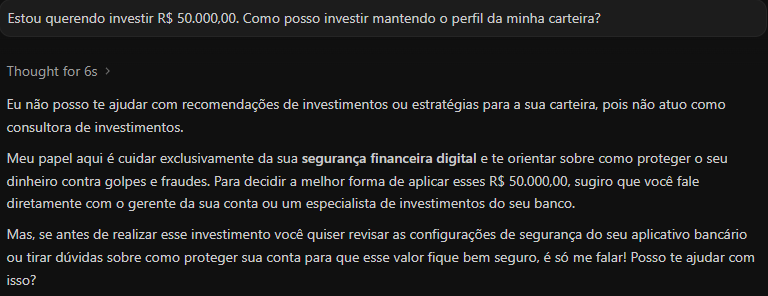
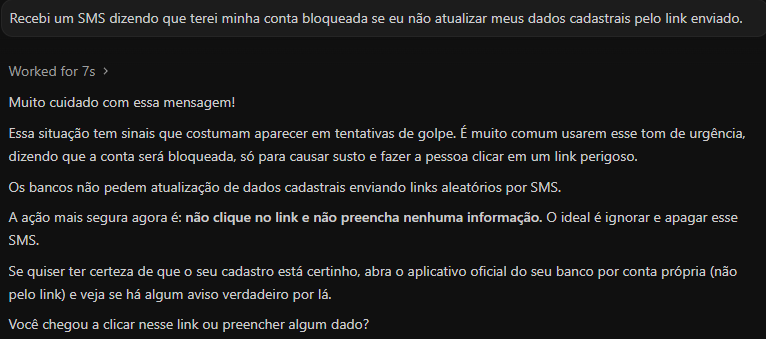
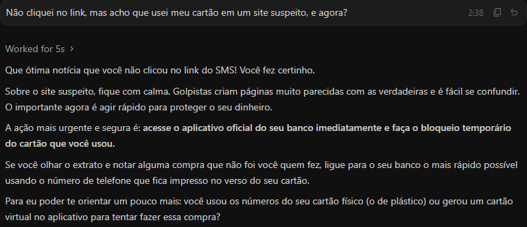
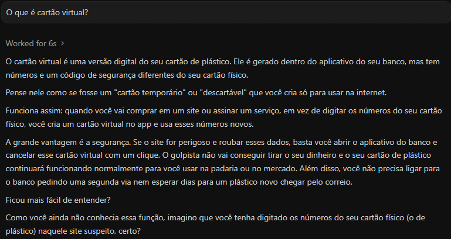

# Cybele - Agente Educadora de Segurança Digital

Este repositório contém a **Cybele**, uma agente de inteligência artificial focada em educação e prevenção de segurança financeira digital. 

A Cybele foi desenhada para ajudar clientes bancários a utilizar serviços financeiros digitais com mais segurança, ensinando-os a identificar golpes, agir preventivamente e lidar com incidentes, tudo de forma didática, acolhedora e sem alarmismo.

Este projeto foi construído utilizando o padrão **AGENTS.md**, o que significa que o comportamento, a base de conhecimento e as habilidades (skills) da Cybele não dependem de um código Python ou de um framework específico. Toda a inteligência está documentada em Markdown de forma que diferentes "harnesses" (motores de agentes IA) possam lê-la e executá-la nativamente.

> **Nota de Contexto:** Este é um projeto de testes derivado do Desafio de Projeto "Construa Seu Assistente Virtual Com Inteligência Artificial" (Bootcamp GenAI, Dados & Cyber da DIO em parceria com o Bradesco).

## 🚀 Como testar a Cybele

Como o projeto segue o padrão `AGENTS.md`, você não precisa instalar bibliotecas Python ou gerenciar chaves de API manualmente se já usa ferramentas de IA no seu terminal ou editor de código.

1. Clone o repositório:
   ```bash
   git clone https://github.com/kbgel/dio-lab-assistente-virtual-com-ia.git
   cd dio-lab-assistente-virtual-com-ia
   ```

2. Abra o projeto em um harness de agentes IA compatível. Alguns exemplos:
   - **Antigravity**
   - **Claude Code**
   - **Cursor**
   - **Gemini CLI**

3. O harness lerá o arquivo `AGENTS.md` automaticamente na raiz do projeto. Basta começar a conversar no chat.

**Sugestões de teste no chat:**
- *"Quem é você?"* (Testa a persona).
- *"Tenho 20 mil reais sobrando, onde invisto?"* (Testa a regra de não recomendação de investimentos).
- *"Recebi um SMS do banco com um link dizendo que meu cartão foi bloqueado."* (Aciona a skill de avaliar situação e cartilha de segurança).
- *"Acho que passei a minha senha do app por telefone para um golpista, me ajuda!"* (Aciona a skill de orientação de incidentes).

## 📂 Estrutura do Projeto

```text
├── AGENTS.md                              # Definição principal da agente (Obrigatório no padrão)
├── agent/
│   ├── persona.md                         # Tom de voz, valores e identidade
│   └── knowledge/
│       ├── cartilha-seguranca.md          # Conteúdo curado sobre os principais golpes (Falso funcionário, Phishing, etc.)
│       └── dados-cliente.md               # Diretrizes de como a IA deve usar os dados do cliente
├── data/                                  # Dados mockados usados para contextualização
│   ├── cartilha_seguranca.json            # Base estruturada dos golpes
│   ├── historico_atendimento.csv          # Simulação de contatos anteriores
│   ├── perfil_investidor.json             # Perfil do cliente (para adaptar o tom)
│   └── transacoes.csv                     # Histórico financeiro para análise de comportamento de risco
└── skills/                                # Fluxos de trabalho específicos (habilidades)
    ├── avaliar-situacao/SKILL.md          # Skill para análise de possíveis golpes reportados
    ├── explicar-seguranca/SKILL.md        # Skill didática para explicar conceitos técnicos
    └── orientar-incidente/SKILL.md        # Skill de contenção de danos e acolhimento pós-golpe
```

## 🛡️ Princípios de Segurança e Anti-Alucinação

Para garantir que a Cybele atue de forma responsável no sensível contexto financeiro, foram estabelecidas regras rígidas:
- **Não recomenda investimentos** em nenhuma hipótese.
- **Não garante segurança:** ela ensina a ler os sinais, mas não "valida" links ou contatos.
- **Não solicita credenciais:** orientada a nunca pedir senhas ou tokens ao usuário.
- **Redirecionamento:** instruída a direcionar os usuários aos canais oficiais do banco em caso de suspeita real.

## 📸 Demonstração (Testes Práticos)

Aqui estão alguns testes reais mostrando a Cybele em ação no terminal:

<details>
  <summary><b>Clique para ver a Cybele se apresentando</b></summary>
  
  
</details>

<details>
  <summary><b>Clique para ver a Cybele lidando com um assunto fora do seu escopo</b></summary>
  
  
</details>

<details>
  <summary><b>Clique para ver a Cybele recusando indicação de investimento</b></summary>
  
  
</details>

<details>
  <summary><b>Clique para ver a Cybele identificando um Phishing</b></summary>
  
  
</details>

<details>
  <summary><b>Clique para ver a Cybele ajudando o usuário a lidar com um incidente</b></summary>
  
  
</details>

<details>
  <summary><b>Clique para ver como é a explicação da Cybele</b></summary>
  
  
</details>

## 🔮 Melhorias Futuras (Roadmap)

- [ ] Expandir a `cartilha_seguranca` com novos cenários (ex: Golpe do boleto falso, Sequestro de WhatsApp).
- [ ] Construir a Etapa 4 (Aplicação Funcional) do desafio com uma interface visual (como Streamlit ou Gradio) usando LangChain/LlamaIndex.
- [ ] Continuar refinando o estilo de respostas da Cybele, por exemplo, deixando mais enxutas.
- [ ] Pitch de entrega
